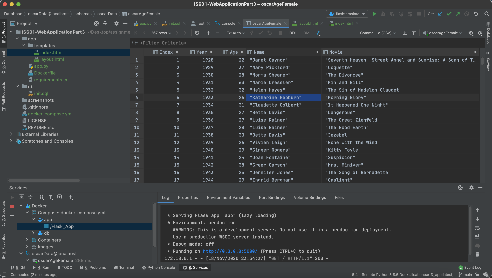
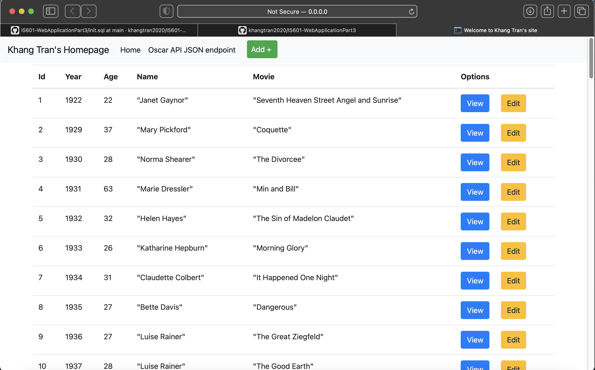
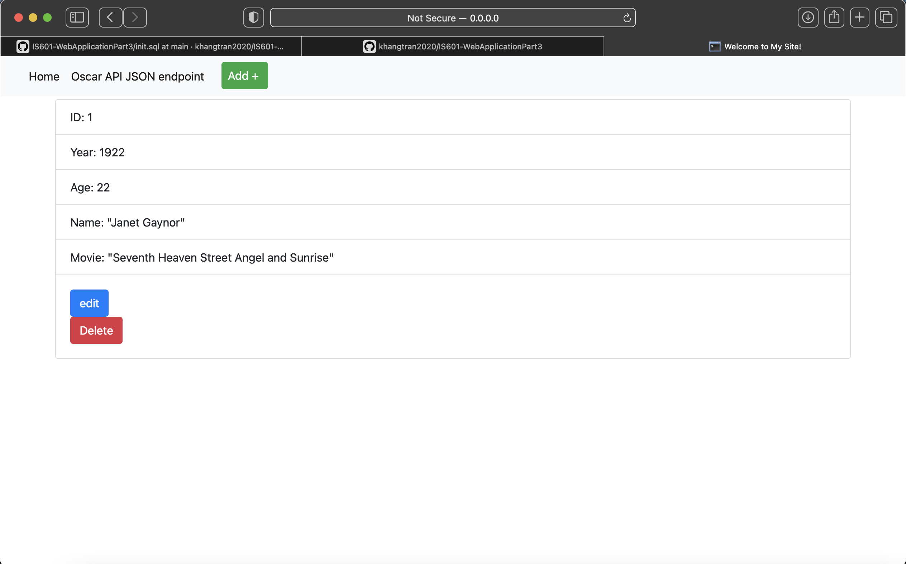
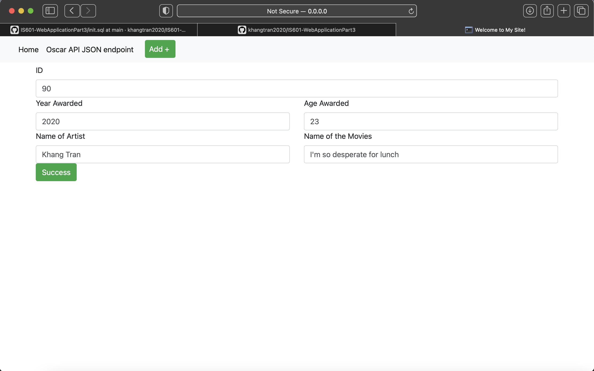
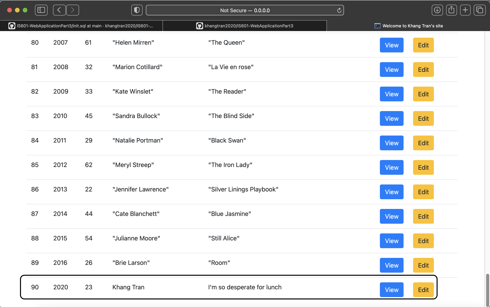
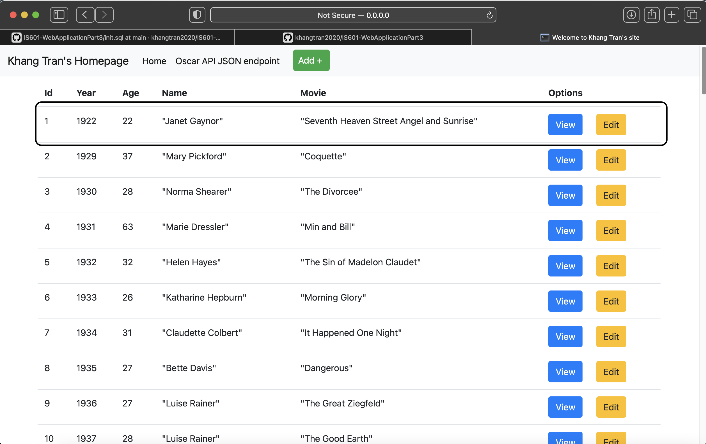
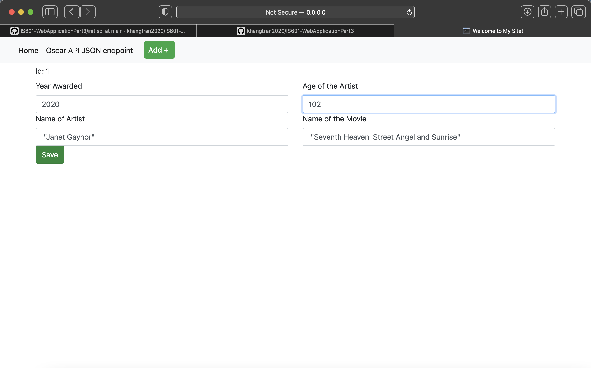
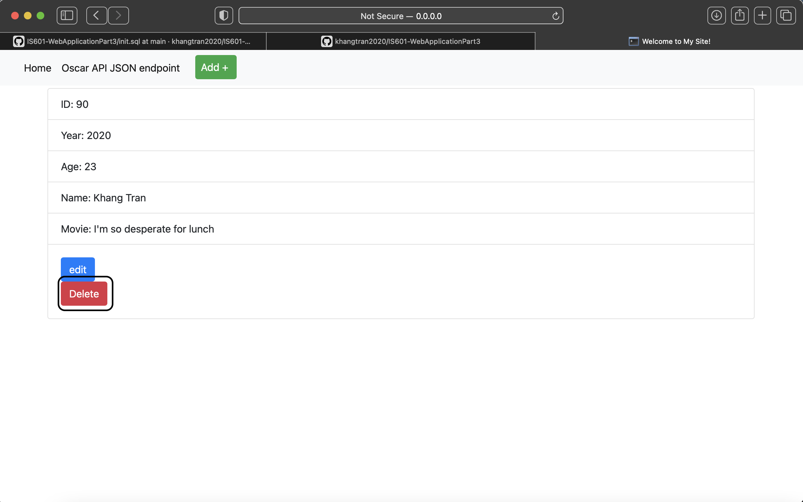
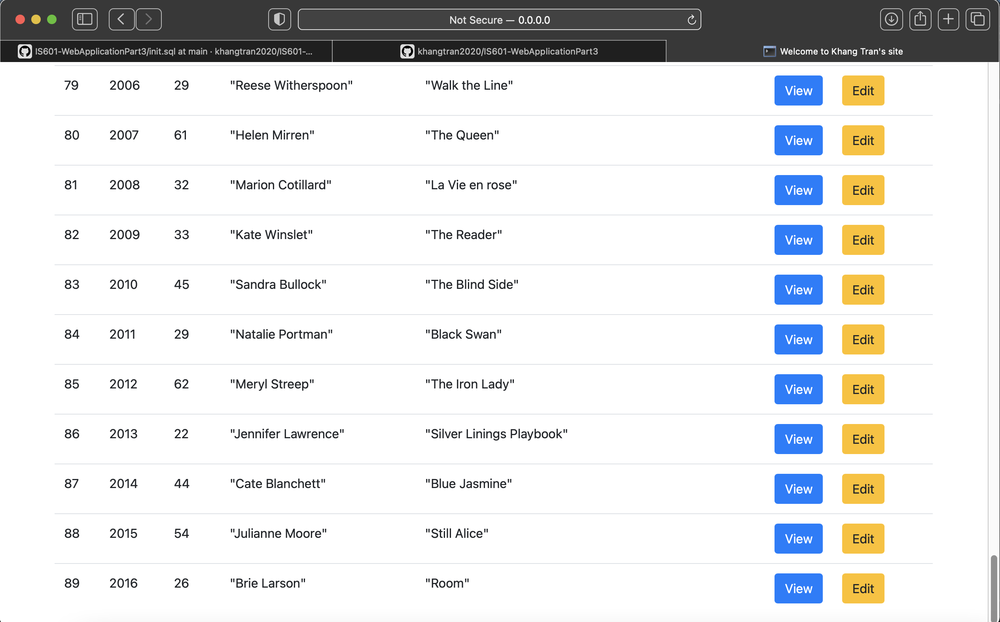

# IS601-WebApplicationPart3

Author: Khang Tran  
Date: November 18, 2020  
Department: Informatics

# Screenshots
## Data in Pycharm

## Homepage

## View Card

## New Data 
### New view

### New Result

## Edit 

## Delete

